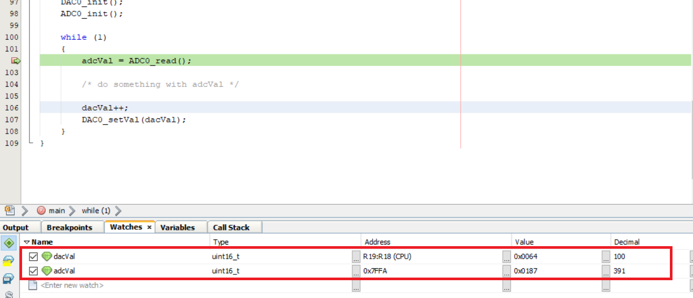

# Getting Started with the Digital-to-Analog Convertor (DAC) Using the AVR64DD32 Microcontroller

 The repository contains four MPLAB® X projects:

1.  [Generating Constant Analog Signal](#1-generating-constant-analog-signal-using-the-10-bit-dac) – This use case shows how to generate a constant signal using the DAC peripheral.
2.  [Generating Sine Wave Signal](#2-generating-sine-wave-signal-using-the-10-bit-dac) – This use case shows how to generate a sine wave signal using the DAC peripheral.
3.  [Generating Amplitude Modulated Signal](#3-generating-amplitude-modulated-signal-using-the-10-bit-dac) – This use case shows how to generate an amplitude modulated signal using the DAC peripheral.
4.  [Reading DAC with ADC](#4-reading-the-dac-internally-with-the-adc) – This project provides a bare metal code example for a basic DAC configuration. This use case shows how to read the voltage on DAC0 output with the ADC0.

## Related Documentation

More details and code examples on the AVR64DD32 can be found at the following links:

- [AVR64DD32 Product Page](https://www.microchip.com/wwwproducts/en/AVR64DD32)
- [AVR64DD32 Code Examples on GitHub](https://github.com/microchip-pic-avr-examples?q=AVR64DD32)
- [AVR64DD32 Project Examples in START](https://start.atmel.com/#examples/AVR64DD32CuriosityNano)

## Software Used

- [MPLAB® X IDE](http://www.microchip.com/mplab/mplab-x-ide) v6.00 or newer
- [MPLAB® XC8](http://www.microchip.com/mplab/compilers) v2.36 or newer
- [AVR-Dx Series Device Pack](https://packs.download.microchip.com/) v2.1.152 or newer

## Hardware Used

- The AVR64DD32 Curiosity Nano Development Board is used as a test platform.
   
- Oscilloscope/Logic Analyzer

## Operation

To program the Curiosity Nano board with this MPLAB® X project, follow the steps provided in the [How to Program the Curiosity Nano Board](#how-to-program-the-curiosity-nano-board) chapter.  

## 1. Generating Constant Analog Signal Using the 10-Bit DAC

This use case shows how to generate a constant signal using the DAC peripheral. Initialize the DAC, set the 2.048V internal voltage reference for the DAC peripheral and set the DAC to output a specific constant voltage.

### 1.1 Setup

The following configurations must be made for this project:

- System clock is configured at 4 MHz (default)
- VREF:
  - Select the 2.048V internal voltage reference for the DAC peripheral
  - Set the voltage reference in Always-On mode
- DAC0:
  - Enable the DAC
  - Enable the output buffer
  - Enable the Run-In Standby mode
  - Disable the digital input buffer and the pull-up resistor for the DAC output external pin (PD6)

### 1.2 Demo

 PD6 – Constant analog signal (1.2V) on Channel 0 (black) below
 

### 1.3 Summary

This example represents a basic functionality of the DAC peripheral, which is used to generate a constant signal.  
[Back to top](#getting-started-with-the-digital-to-analog-convertor-dac-using-the-avr64dd32-microcontroller) 

## 2. Generating Sine Wave Signal Using the 10-Bit DAC

This use case shows how to generate a sine wave signal using the DAC peripheral. Initialize the DAC, set the 2.048V internal voltage reference for the DAC peripheral and set the DAC to output the samples of a sine wave in a loop.

### 2.1 Setup

The following configurations must be made for this project:

- System clock is configured at 4 MHz (default)
- VREF:
  - Select the 2.048V internal voltage reference for the DAC peripheral
  - Set the voltage reference in Always-On mode
- DAC0:
  - Enable the DAC
  - Enable the output buffer
  - Enable the Run-In Standby mode
  - Disable the digital input buffer and the pull-up resistor for the DAC output external pin (PD6)

### 2.2 Demo

 PD6 – Sine wave on Channel 0 (black) below
 

### 2.3 Summary

This example represents a basic functionality of the DAC peripheral, which is used to generate a sine wave signal by setting the output in a loop.  
[Back to top](#getting-started-with-the-digital-to-analog-convertor-dac-using-the-avr64dd32-microcontroller) 

## 3. Generating Amplitude Modulated Signal Using the 10-Bit DAC

This use case shows how to generate an amplitude modulated signal using the DAC peripheral. Initialize the DAC with external voltage reference and link the signal that must be modulated to the external reference pin (PD7). The AVR® core will continuously change the Data (DACn.DATA) register to create a modulated signal.

### 3.1 Setup

The following configurations must be made for this project:

- System clock is configured at 4 MHz (default)
- VREF:
  - Select the external voltage reference on the VREFA pin (PD7) for the DAC peripheral
  - Set the voltage reference in Always-On mode
- DAC0:
  - Enable the DAC
  - Enable the output buffer
  - Enable the Run-In Standby mode
  - Disable the digital input buffer and the pull-up resistor for the DAC output external pin (PD6)

|     Pin     | Configuration  |
| :---------: | :------------: |
| PD7 (VREFA) |  Analog input  |
| PD6 (DAC)   |  Analog output |

### 3.2 Demo

 External Analog Signal (information signal) on the PD7 (VREFA) pin – Channel 1 (orange) in the screenshot below
 Amplitude Modulated Signal on the PD6 pin – Channel 2 (blue) in the screenshots below

 

 

### 3.3 Summary

This example represents a basic functionality of the DAC peripheral, which is used to generate an amplitude modulated signal using an external signal.  
[Back to top](#getting-started-with-the-digital-to-analog-convertor-dac-using-the-avr64dd32-microcontroller) 

## 4. Reading the DAC Internally with the ADC

This project provides a bare metal code example for a basic DAC configuration. This use case shows how to read the voltage on the DAC0 output with the ADC0. Initialize the DAC and ADC and set the DAC peripheral as input for the ADC. Then set the 2.048V internal voltage reference for the DAC and ADC peripherals, increment the DAC output and read it with the ADC for each step.

### 4.1 Setup

The following configurations must be made for this project:

- System clock is configured at 4 MHz (default)
- VREF:
  - Select the 2.048V internal voltage reference for the DAC peripheral
  - Select the 2.048V internal voltage reference for the ADC peripheral
  - Set both voltage references in the Always-On mode
- DAC0:
  - Enable the DAC
- ADC0:
  - Enable the ADC
  - Select the 12-bit resolution
  - Select the DIV2 prescaler
  - Set the DAC peripheral as input for the ADC

### 4.2 Demo

 Theoretical results for dacVal = 100
 
 Practical results for dacVal = 100 (using Debug mode)
 

### 4.3 Summary

This example represents a basic functionality of the DAC peripheral. The ADC peripheral reads the value from a step-by-step incremented value for the DAC peripheral.  
[Back to top](#getting-started-with-the-digital-to-analog-convertor-dac-using-the-avr64dd32-microcontroller) 

## How to Program the Curiosity Nano Board

This chapter shows how to use the MPLAB® X IDE to program an AVR® device with an Example_Project.X. This can be applied to any other projects.

- Connect the board to the PC

- Open the Example_Project.X project in MPLAB® X IDE

- Set the Example_Project.X project as main project

  - Right click the project in the **Projects** tab and click **Set as Main Project**
     

- Clean and build the Example_Project.X project

  - Right click the **Example_Project.X** project and select **Clean and Build**
     

- Select **AVRxxxxx Curiosity Nano** in the Connected Hardware Tool section of the project settings:

  - Right click the project and click **Properties**
  - Click the arrow under the Connected Hardware Tool
  - Select **AVRxxxxx Curiosity Nano** (click on the **SN**), click **Apply** and then **OK**
     

- Program the project to the board
  - Right click the project and click **Make and Program Device**
     

 

- [Back to 1. Generating Constant Analog Signal](#1-generating-constant-analog-signal-using-the-10-bit-dac)
- [Back to 2. Generating Sine Wave Signal](#2-generating-sine-wave-signal-using-the-10-bit-dac)
- [Back to 3. Generating Amplitude Modulated Signal](#3-generating-amplitude-modulated-signal-using-the-10-bit-dac)
- [Back to 4. Reading DAC with ADC](#4-reading-the-dac-internally-with-the-adc)
- [Back to top](#getting-started-with-the-digital-to-analog-convertor-dac-using-the-avr64dd32-microcontroller)
